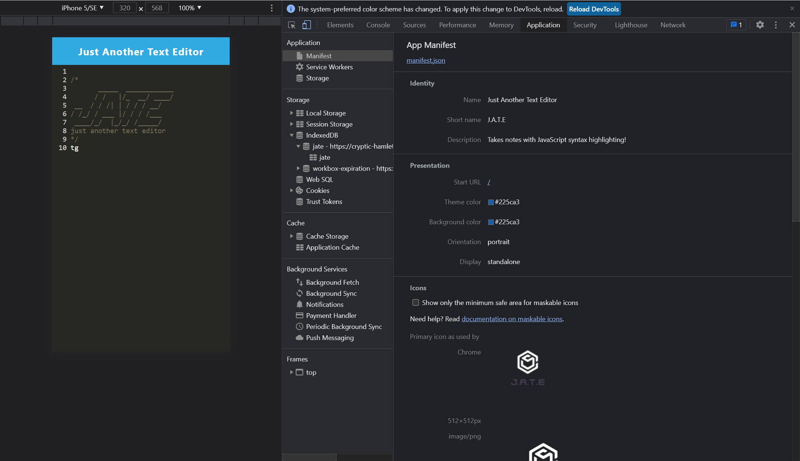
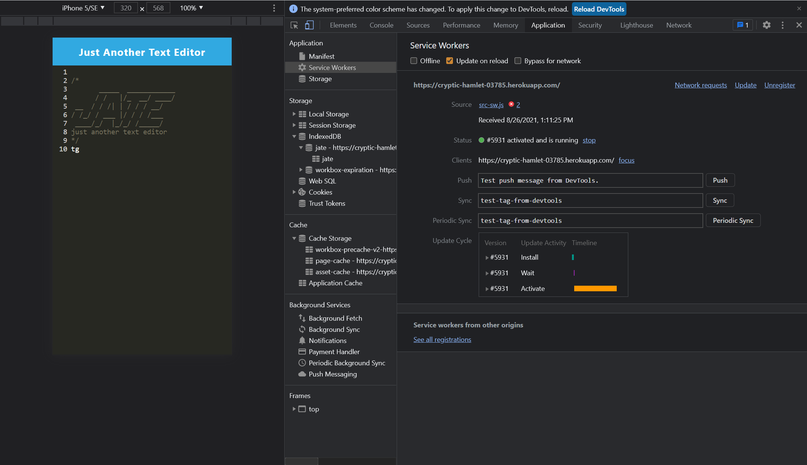

# Challenge19-JATE Progressive Web Applications (PWA) Challenge: Text Editor

## Description

Live Link : https://challenge19-jate-hod3.onrender.com

Your task is to build a text editor that runs in the browser. The app will be a single-page application that meets the PWA criteria. Additionally, it will feature a number of data persistence techniques that serve as redundancy in case one of the options is not supported by the browser. The application will also function offline.

To build this text editor, you will start with an existing application and implement methods for getting and storing data to an IndexedDB database. You will use a package called idb, which is a lightweight wrapper around the IndexedDB API. It features a number of methods that are useful for storing and retrieving data and is used by companies like Google and Mozilla.

You will deploy this full-stack application to Render using the Render Deployment Guide.

Important Notes

Clone the starter code repository and create your own repository with the starter code. Do not fork the starter code repository!

Before starting, clone the starter code to your local machine.

## Deployment

You will deploy this application to Render. Follow the Render Deployment Guide to ensure proper deployment.

## Technologies Used

Webpack: For bundling JavaScript files and plugins.

Workbox: For creating and managing service workers.

IndexedDB: For data persistence.

idb: A lightweight wrapper for IndexedDB.

Render: For deployment.

Getting Started

Clone the starter code repository.

Create a new repository for your project.

Follow the instructions in the Acceptance Criteria to implement the required features.

Use the idb package to interact with IndexedDB.

Test your application to ensure it works offline and meets all PWA criteria.

Scripts

Start the application: npm run start

Build for production: npm run build

Test the service worker: Ensure caching and offline functionality.

## License

This project is licensed under the [MIT LICENSE](LICENSE).
